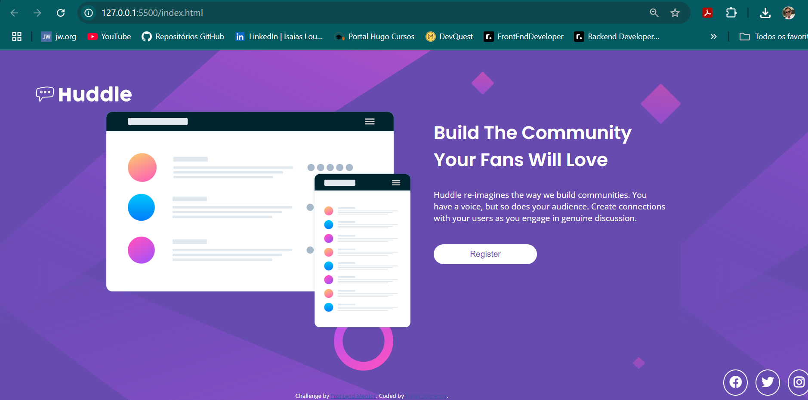

# Frontend Mentor - Huddle landing page with single introductory section solution

## Table of contents

  - [Screenshot](#screenshot)
  - [Links](#links)
  - [Built with](#built-with)
  - [What I learned](#what-i-learned)
  - [Continued development](#continued-development)
- [Author](#author)


### Screenshot



Add a screenshot of your solution. The easiest way to do this is to use Firefox to view your project, right-click the page and select "Take a Screenshot". You can choose either a full-height screenshot or a cropped one based on how long the page is. If it's very long, it might be best to crop it.

### Links

- Solution URL: [Add solution URL here](https://isaiaslourenco.github.io/quest-css-avancado/)
- Live Site URL: [Add live site URL here](https://github.com/IsaiasLourenco/quest-css-avancado)

### Built with

- Semantic HTML5 markup
- CSS custom properties
- Flexbox
- CSS Grid


### What I learned

I learned that I should write down as much as I can from my studies, because in challenges like this, I can consult all my notes and achieve the goal more easily.

To see how you can add code snippets, see below:

```html
<h1>Some HTML code I'm proud of</h1>
```
```css
.proud-of-this-css {
  color: papayawhip;
}
```
```js
const proudOfThisFunc = () => {
  console.log('🎉')
}
```


### Continued development

I realized that I need to keep studying CSS, I almost got there, but we always need to keep learning, and never give up and keep striving to achieve the goals, I think I reached 75% of the total result. I'm proud!

## Author

- Website - [Add your name here](https://isaiaslourenco.github.io/vetor256/)
- Frontend Mentor - [@yourusername](https://www.frontendmentor.io/profile/IsaiasLourenco)